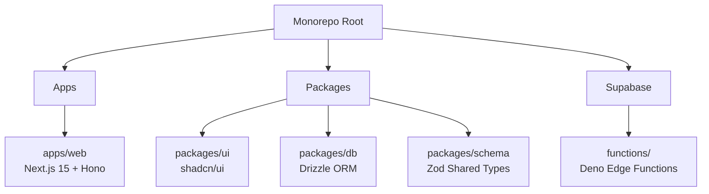

### ディレクトリ構造詳細

```text
.
├── apps/
│   └── web/                      # メインのNext.jsアプリケーション
│       ├── app/                  # Next.js App Router
│       │   ├── (auth)/           # 認証関連ページ (login, etc)
│       │   ├── (dashboard)/      # アプリのメイン画面
│       │   │   ├── page.tsx      # カンバンボード表示 (Status Board)
│       │   │   ├── quiz/         # クイズ機能
│       │   │   └── settings/     # 設定 (APIキー管理, AI Toggle)
│       │   ├── api/
│       │   │   └── [[...route]]/ # Hono API Entrypoint (Sync API)
│       │   │       └── route.ts  # Hono Adapter
│       │   ├── layout.tsx
│       │   └── providers.tsx     # React Query, Theme Provider
│       │
│       ├── components/
│       │   ├── features/         # 機能単位のコンポーネント
│       │   │   ├── kanban/       # カンバンボード, DndKit実装
│       │   │   ├── quiz/         # クイズUI, タイマー, 選択肢
│       │   │   └── vocab/        # 単語登録・編集モーダル
│       │   │       ├── vocab-form.tsx
│       │   │       ├── chat-panel.tsx     # AIへの指示チャット
│       │   │       └── status-indicator.tsx # 生成中表示(Optimistic UI)
│       │   └── ui/               # shared/ui からのexport または ローカルUI
│       │
│       ├── lib/
│       │   ├── auth/             # Supabase Auth Helpers
│       │   ├── crypto/           # [重要] BYOK用クライアント暗号化ロジック
│       │   │   ├── encryption.ts # Web Crypto API (AES-GCM) 実装
│       │   │   └── key-store.ts  # 復号キーのオンメモリ管理 (Zustand連携)
│       │   ├── hooks/
│       │   │   ├── use-realtime.ts # [重要] Supabase Realtime購読フック
│       │   │   └── use-vocab.ts    # React Query Mutations
│       │   └── supabase/         # Supabase Client setup
│       │
│       ├── server/               # Hono (Backend Logic on Next.js)
│       │   ├── app.ts            # Hono App Definition
│       │   └── routes/           # 各種APIルート
│       │       └── vocabulary.ts # CRUD, Search
│       │
│       ├── stores/               # Client State (Zustand)
│       │   ├── use-app-store.ts  # UI状態
│       │   └── use-session-store.ts # APIキー(復号後)の一時保持
│       │
│       ├── .env.local            # Public Env Variables
│       └── next.config.js
│
├── packages/                     # 共有パッケージ (Turborepo)
│   ├── db/                       # データベース定義 (Drizzle ORM)
│   │   ├── src/
│   │   │   ├── index.ts          # DB Connection
│   │   │   └── schema.ts         # Table Definitions (pgvector含む)
│   │   ├── drizzle.config.ts
│   │   └── package.json
│   │
│   ├── schema/                   # [重要] 型定義・バリデーション共有
│   │   ├── src/
│   │   │   ├── index.ts
│   │   │   └── api-types.ts      # Zod Schemas (Frontend/Backend共有)
│   │   └── package.json
│   │
│   ├── ui/                       # UIコンポーネントライブラリ (shadcn/ui)
│   │   ├── src/
│   │   │   ├── button.tsx
│   │   │   ├── dialog.tsx
│   │   │   └── ...
│   │   ├── tailwind.config.ts    # Shared Tailwind Config
│   │   └── package.json
│   │
│   ├── eslint-config/            # Shared ESLint Config
│   └── typescript-config/        # Shared TS Config
│
├── supabase/                     # Supabase設定 & Edge Functions
│   ├── functions/                # [重要] Async AI Processing (Deno)
│   │   ├── _shared/              # Edge Functions間の共有コード
│   │   │   ├── openai-client.ts  # OpenAI SDK Wrapper (BaseURL Switch)
│   │   │   └── supabase-admin.ts
│   │   │
│   │   ├── process-vocabulary/   # 単語補完ジョブ (Webhook/Async)
│   │   │   └── index.ts          # AI生成 & Safe Mergeロジック
│   │   │
│   │   ├── generate-quiz/        # クイズ・誤答生成ジョブ
│   │   │   └── index.ts          # pgvector検索 & Distractor生成
│   │   │
│   │   └── import-dictionary/    # 外部辞書(金フレ等)インポート用
│   │
│   ├── migrations/               # SQL Migrations (pgvector setup)
│   ├── config.toml
│   └── seed.sql
│
├── turbo.json                    # Turborepo Pipeline Config
├── package.json                  # Root Package
├── pnpm-lock.yaml
└── pnpm-workspace.yaml
```

### 設計のポイント

1.  **`apps/web/lib/crypto/`**:

      * 要件「2.2 APIキー管理」の中核です。Web Crypto APIを用いた暗号化・復号ロジックをここに集約します。サーバーサイドには一切コードを漏らさないため、`web` アプリ内に閉じています。

2.  **`supabase/functions/` (Edge Functions)**:

      * 要件「4.1 新規登録時の挙動」「4.4 クイズ機能」を実現する場所です。
      * Next.js側 (`apps/web`) からは「撃ちっ放し」でここにリクエストを投げるか、DBトリガー経由で起動させます。
      * `_shared` フォルダに OpenAI SDK の初期化ロジック（BaseURLの切り替え等）を置くことで、各FunctionでBYOKロジックを再利用します。

3.  **`apps/web/server/` (Hono)**:

      * 要件「3.1 Synchronous API」の実装場所です。Next.jsのAPI Routesとしてマウントされますが、中身はHonoで記述し、型安全なRPC (`hc`) をフロントエンドに提供します。

4.  **`packages/db` & `packages/schema`**:

      * **DBスキーマ** (`drizzle`) と **API型定義** (`zod`) をパッケージ化することで、`web` アプリと `supabase` (Edge Functions) の両方から、同じ型・同じテーブル定義を参照できるようにします（※Deno環境でのインポートには工夫が必要な場合がありますが、コードの二重管理を防ぐための構成です）。

5.  **`apps/web/components/features/vocab/status-indicator.tsx`**:

      * 要件「4.1 一覧画面での表示」「5.1 リアルタイム表示変更」に対応するコンポーネントです。Supabase Realtimeからの通知を受け取り、生成中表示を制御します。